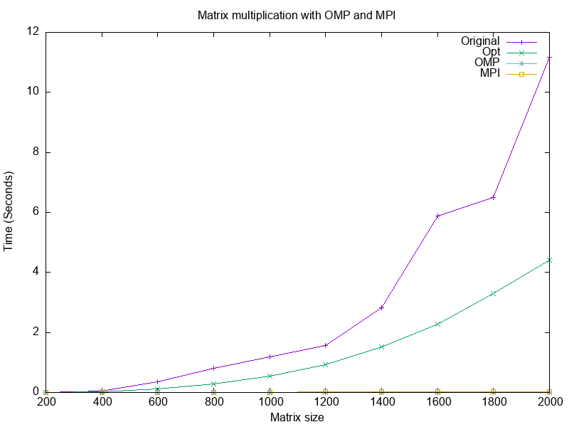
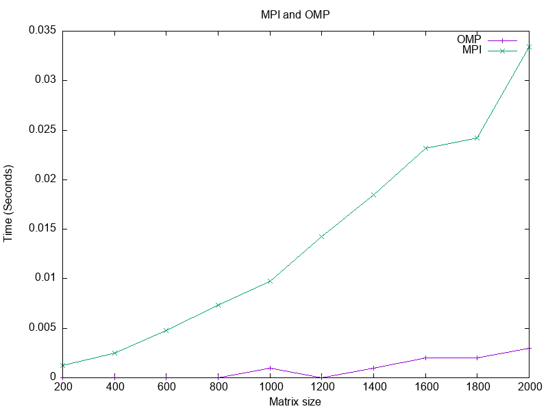

# matrix-01-jayamohan-domimico-yusefpowar
matrix-01-jayamohan-domimico-yusefpowar created by GitHub Classroom
# Parallel Lab

## Architechture of solutions:
For this project we worked on several different parts.  For the first portion there were several tasks we worked on.  The first one involved automating the matric multiplicand that was given to us. In order to do that we have a file called autoMmult.c that allows us to call mmult.c in order to perform that type of multiplication.  In order to be able to call these different portion we included a mat.h file which allows us to call the different forms of multiplication to use else where. This file will generate matrixes and will also populate the files that are used to generate the graphs for different types of multiplication.  Inside this file it will clock how long each types takes and pass that info to a file. These algoData files will be filled by a separate graph generation file that will then cause graphs to be created easily and without anything extra on our part. 
The next two tasks are very similar in what they do with slight differences. We added for loops in order to implement SMID parallel computing.  It allowed for instructions that will occur on the loaded data within one operation.  Adding this for loop places in the file allows for parallelization when run without it, it would just be a standard matrix multiplication without it.  These two tasks worked hand in hand together to show the difference in what occurs when these two types of multiplication are ran.  
The next tasks uses OpenMD which has us having a primary thread with forked sub threads used to divide the work amongst themselves.  To see how the matrixes react with this form we can look at the file mmult_omp_timing.c. This file allows for those worker threads to be created and work with as a unit in order to complete the multiplication that is needed.  To follow this task we have MPI to established next. These two tasks follow a similar idea but are based off of a different format of memory. The OpenMP would share memory devices while the MPI would be able to program with distributed memory. These two differences in how they function will then be shown in the graph that has been provided. This graph will provide visual proof of the difference these two methods share. When looking at the code between the two it seems to look somewhat similar in the method that it takes but with the differences in memory makes a significant difference.  
The two additional tasks we selected for this project were matrix mulipication in C on Wolfgand cluster with both OpenMP and MPI along with the automation for the production of the graphs. While working on the above tasks especially number 1 and 2 we created the gnuplot file and have everything be routed together. We have files that will take the data in right away from the multiplication and then have that data be supplied to the graphs in order to be created. For the other additional task, we were able to combine the mpi and omp together so that these worker thread option would be able to work together in order to complete the multiplication. We were given the unfinished file for this part and had certain parts to fill in. In order to allow this to work we have a buffer that is essential passed around and gathering statuses and states of the matrixes in order to know what else needs to be done by the created worker threads.  

## Team Work:

### Akeem Yusef Powar 

I was responsible for making autoMmult do automatic matrix multiplication using the provided and SIMD optimised algorithms and measuring time taken. I implemented the mpiMmult solution agreed upon and and addtional function that creates files if none exist. I also added the file needed to make graphs automatically using gnuplot.

### Aathira Jayamohan
I was responsible for Task 4, matrix multiplication in C on Wolfgangd Cluster with OpenMP. I also ocreated the graphs for comparing original, SIMD, OMP, and MPI with the help of Akeem's file for gnuplot. 

### Alyssa  Dominico
I was repsonsible for the additonal task of combining omp and mpi. I helped work on the write up for this lab. 

## Project Life cycle

As this project wasn’t too big and there were only a limited amount of tasks to do, our project board wasn’t used much as what was being done at any time was clear, deadlines were fixed and we had other means of confirming what’s happening project wise.

The usual cycle “write code, compile code,  run code, test code” was basically the approach with the addition of research. Understanding the different implementations and how they work and behave was fundamental and a brute force approach, checking  output did not achieve this. (I did try)  

For testing, Small matrices were used to test accuracy of execution but for working on larger matrices (3*3>) timing was the time factor in determining accuracy of code. If a 200x200 matrix takes the same time as a 2000x2000, there is an error.  

Based on the email that was sent out on the Oct 23, an additional function was added that generates a file with a X * X matrix if one does not exist. This function is called by the MPI program if it needs to create a file before running. This allows the program to be tested with specific sized matrices if wanted.

As part of task 1, automatic graph functionality was implemented because that was believed to be the only way  before realising it was an additional assignment

This graph shows the time taken in seconds for the original , SIMD, OMP and MPI  algorithms do matrix multiplication 

This graph shows the OMP and MPI on a viable scale

## Reseach Question 

SIMD allows data to be processed over multiple machines by a single instruction and is ideal for calculation-based tasks.  

MPI is a standard used in distributed applications that communicate over a network. 
It is designed for high performance regardless of system size. 
Interface (mpi.h in c) implementation Proves functions like MPi size (How many processes) & rank (Id calling process) to get environment variables 
and uses MPI_Bcast, send & recv to communicate data between processes. 

OMP is a library used in parallel programming to share memory. 
It implements a Controller thread that runs from start to finish. 
This thread creates Worker threads when needed and waited for them to join after each assigned task. 

SIMD refers to single instruction processing where as MPI is a messaging passing interface and OMP is a means of sharing memory.
SIMD programs will all process the same instruction where as in MPI and OMP, multiple instructions can be processed at once.
In MPI programming, processes have their own memory space are aware of what the controller wants workers to know. In OMP,
all processes share memory and work in parallel in the same space.

